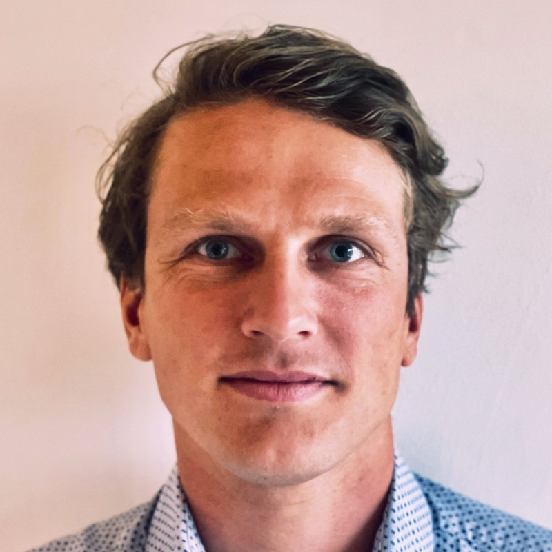

<section class="bio-layout">
	<aside class="profile-panel">
		
		

			<a class="pill-button" href="https://scholar.google.com/citations?user=E968uWQAAAAJ&hl=nl">Google Scholar</a>
			<a class="pill-button" href="https://github.com/RuurdKuiper">GitHub</a>
			<a class="pill-button" href="https://huggingface.co/Ruurd/spaces">Hugging Face</a>
			<a class="pill-button" href="https://www.linkedin.com/in/ruurd-kuiper/">LinkedIn</a>
			<a class="pill-button" href="https://orcid.org/0000-0002-6511-3896">ORCID</a>
			<a class="pill-button" href="Academic%20Cv%20%E2%80%94%20Ruurd%20Kuiper.pdf">CV (PDF)</a>
		

	</aside>

	

		

			I am <strong>Ruurd Kuiper</strong>, Assistant Professor in AI and NLP for Healthcare at UMC Utrecht.
			My background combines biomedical engineering, medical image analysis, and clinical AI,
			with a focus on translating machine learning methods into workflows that are useful and trustworthy in practice.
		

		

			I completed my BSc in Life Science and Technology at TU Delft and Leiden University,
			followed by an MSc in Biomedical Engineering at TU Delft.
			During my PhD at UMC Utrecht, I worked on medical imaging techniques for orthopaedic applications,
			including segmentation, registration, and data-driven planning support.
		

		

			Today, my research centers on language models and AI-assisted clinical workflows:
			from medical documentation support to robust evaluation of LLMs in healthcare contexts.
			Alongside research, I teach AI courses in healthcare and supervise students working at the intersection
			of machine learning and real clinical impact.
		

	

</section>
